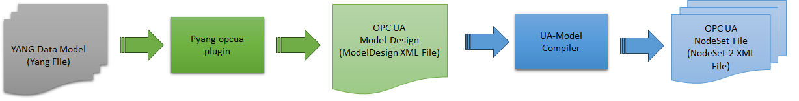

**YANG to OPC UA Model Mapping**

This project defines methods and tools to support interoperability between YANG models and OPC UA models. The project includes the pyang plugin, which facilitates the generation of an OPC UA Model Design XML file from a YANG file. Subsequently, the generated model design XML file can be compiled using OPC UA Model compilers to produce OPC UA NodeSet2 XML files.

**Overview** 

Private 5G networks, also referred to as Non-Public Networks, have become the de facto technology for driving Industry 4.0, delivering a revolutionary user experience by linking objects, machines, and individuals. However, deploying private 5G networks in industrial settings poses significant challenges, including the complexity of their setup, the specialized technical expertise required for their management, and the lack of support for interoperability and manageability using existing industrial applications or Manufacturing Execution Systems (MES). OPC UA (Open Platform Communication Unified Architecture) serves as a platform-independent standard for industrial automation device and system communication. The Open Radio Access Network Working Group 10 has defined Yet Another Next Generation (YANG) as a standard method for managing 5G network systems. The project's goal is to facilitate interoperability between private 5G network systems and OPC UA-based industrial applications by supporting the generation of OPC UA information models from the YANG data models. By converting the YANG data models to OPC UA models, any network devices exposing YANG data models can be managed using existing industrial applications based on OPC UA, enabling YANG/NETCONF devices to operate independently without modification and seamlessly integrate with OPC UA-based industrial applications for management.

**OPC UA NodeSet2 XML generation from YANG Model**

Generation of the OPC UA Information model from the YANG schema involves a two-step approach. First, the YANG file is passed to the pyang opc-ua plugin to generate the OPC UA model design XML file that conforms to the schema defined in the UA Model Design.XSD. Then, the OPC UA model design XML file is passed to the OPC foundation model compiler to generate the OPC UA NodeSet2 XML Files and different language SDK files.

 

OPC UA Model Design to OPC UA NodeSet2 XML File generation

$ pyang -f opc_ua inputfiles/simple-example.yang -o generatedfiles/simple-example-model.xml

$ /app/Opc.Ua.ModelCompiler.exe -console -d2 generatedfiles/simple-example-model.xml -cg generatedfiles/uamodel-generatedfiles/simple-example-model.csv -o2 generatedfiles/uamodel-generatedfiles/

**OPC UA – pyang plugin**

Static YANG to OPC UA Model Design Generator is developed based on open-source component pyang and pyang [uml plugin](https://github.com/mbj4668/pyang/blob/master/pyang/plugins/uml.py). The pyang UML plug-in generates a UML class diagram from the YANG file. The YANG parsing logic defined in UML plug-in code is extended, and a new plugin called opcua plugin is created to generate the OPC UA model design file from the YANG File. The opc-ua pyang plugin logic for the generation of OPC UA model design file is based on the YANG to OPC UA mapping developed by the authors. This opcua plugin code will be delivered to pyang project once it is fully validated with all scenarios.
